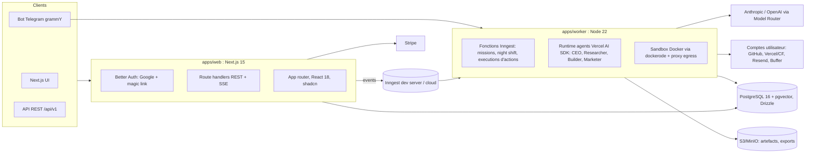

SPEC D'IMPLÉMENTATION POUR CLAUDE CODE : "ATELIER" (stack TypeScript full-stack)
Utilisation : place ce fichier à la racine d'un repo vide sous le nom `SPEC.md`, ouvre Claude Code dans ce repo, et donne comme premier prompt : "Lis SPEC.md en entier. Exécute la Phase 0 uniquement, en respectant les règles de travail de la section 15. À la fin, montre-moi les critères d'acceptation validés." Puis enchaîne les phases une par une, jamais tout d'un coup.
1. Mission
Tu es Claude Code et tu vas implémenter ATELIER (nom de code, renommable) : une plateforme SaaS multi-tenant pour solopreneurs, indie hackers et freelances, où l'utilisateur décrit une idée de business et où une équipe d'agents IA la planifie, la construit (code + déploiement), la marchande (contenu, prospection) et l'opère en continu, y compris la nuit pendant que l'utilisateur dort.
Le produit fusionne deux références et corrige la première :

* Le périmètre de Polsia : planification business, construction du produit, marketing, prospection, cycles autonomes de type "night shift", pilotage conversationnel.
* Les capacités d'Hermes Agent : mémoire persistante qui s'approfondit, skills auto-générées et portables (format agentskills.io), agent joignable partout via un gateway de messagerie (Telegram d'abord), automatisations planifiées, subagents spécialisés.
* La correction des échecs documentés de Polsia, transformés en features vendeuses : tous les assets (repo, hébergement, domaine, listes emails) appartiennent à l'utilisateur sur SES comptes ; budget IA plafonné avec compteur temps réel et coupure nette ; toute action irréversible (publier, envoyer, déployer en prod, dépenser) passe par une file d'approbation tant que l'utilisateur n'a pas monté le niveau d'autonomie ; journal d'activité complet et exportable. Slogan interne : "le Polsia auquel tu peux faire confiance".
2. Décisions produit (tranchées avec le fondateur, ajustables par lui seul)

1. Cible : solopreneurs et indie hackers, B2C/prosumer, SaaS multi-tenant uniquement. Onboarding grand public : login Google + magic link email, pas de mot de passe.
2. Unité centrale : la "venture" (le business de l'utilisateur). Un utilisateur peut avoir plusieurs ventures. Chaque venture a son équipe d'agents, sa mémoire, son budget, son repo, ses canaux.
3. Équipe d'agents par venture (rôles fixes en v1) :
   * CEO : décompose les objectifs en missions, priorise le backlog, arbitre, rédige le brief du matin, tient la mémoire de la venture. C'est lui qu'on contacte par chat.
   * Researcher : étude de marché, concurrence, pricing, avec accès web.
   * Builder : construit et fait évoluer le produit. Implémentation = Claude Code en mode headless dans une sandbox Docker, sur un repo GitHub appartenant à l'utilisateur, déployé sur le compte Vercel ou Cloudflare Pages de l'utilisateur.
   * Marketer : plan de contenu, posts réseaux sociaux, articles SEO, séquences de prospection email. Tout part en brouillon vers la file d'approbation par défaut.
   * Support (v2, pas en v1).
4. Périmètre construit par le Builder en v1 : landing page + capture d'emails (waitlist), site vitrine, micro-SaaS simple à partir de templates Next.js. Pas de "n'importe quelle app" en v1 : périmètre templates assumé, extensible.
5. Autonomie graduée par classe d'action :
   * Classe A (réversible, privé) : brouillons, code sur branche, recherche. Auto par défaut.
   * Classe B (visible, réversible) : déploiement préversion, push sur branche. Auto avec notification.
   * Classe C (irréversible ou publique) : publier un post, envoyer des emails, déployer en production, toucher au DNS, dépenser de l'argent. Approbation requise par défaut ; niveau montable par sous-classe (0 approbation, 1 auto + notif + fenêtre d'annulation, 2 auto plafonné).
6. Night shift : cycle autonome planifié par venture (défaut 1 cycle/nuit). Le CEO choisit des missions dans la limite du budget nuit, les dispatche, empile les actions de classe C dans la file d'approbation, envoie un brief du matin sur le canal choisi.
7. Mémoire : docs structurés par venture (brand, icp, tone, decisions, learnings, product) versionnés et injectés dans chaque contexte d'agent ; rappel sémantique (pgvector) ; skills auto-générées au format agentskills.io ; export complet en un clic.
8. Canaux : web chat (v1), bot Telegram (v1), WhatsApp (v2), email bidirectionnel (v2).
9. Monétisation : abonnement Stripe avec budget IA inclus par palier, compteur visible en permanence, dépassement uniquement en top-up opt-in double-confirmé. Jamais de prélèvement surprise.
10. Prospection email conforme par construction : B2B uniquement, volumes limités par palier, unsubscribe obligatoire, suppression list globale non contournable, source des contacts obligatoire.
11. Non-goals v1 : publicités payantes automatisées, levée de fonds automatisée, support entrant, self-hosted, apps mobiles, fine-tuning.
12. Stack : TypeScript full-stack strict (décision fondateur : le meilleur outil pour ce produit, indépendamment de ses habitudes). Fermé, pas d'open source en v1.
3. Architecture globale



Principes :

* `apps/web` (Next.js) : UI, auth, API REST versionnée sous /api/v1, flux SSE (chat, onboarding, compteur de dépense) alimentés par Postgres LISTEN/NOTIFY. Ne fait AUCUN travail long : il émet des événements Inngest.
* `apps/worker` : sert l'endpoint Inngest et exécute tout le travail durable : missions, cycles de night shift, exécution des actions approuvées, bot Telegram (long polling). Les attentes d'approbation humaine utilisent `step.waitForEvent` (timeout 72 h), les crons Inngest déclenchent les night shifts, chaque étape est retryable et idempotente.
* Toute logique métier critique (classification d'actions, budget, ledger, quotas outreach) vit dans `packages/core`, pur TypeScript sans dépendance framework, testé unitairement : ni Next.js ni Inngest ne contiennent de règles métier.
* Tout ce qui entre ou sort passe par des schémas zod partagés (`packages/shared`).
4. Layout du monorepo (pnpm + Turborepo, à créer tel quel en Phase 0)

```
atelier/
├── apps/
│   ├── web/                    # Next.js 15 app router
│   │   ├── app/(marketing)/    # landing du produit lui-même
│   │   ├── app/(app)/          # app authentifiée: ventures, chat, approbations...
│   │   ├── app/api/v1/         # route handlers REST + SSE
│   │   └── app/api/auth/       # Better Auth
│   └── worker/
│       ├── src/inngest/        # fonctions durables (mission.run, nightshift.cycle, action.execute)
│       ├── src/agents/         # runtime + ceo, researcher, builder, marketer
│       ├── src/sandbox/        # dockerode, image sandbox, proxy egress
│       └── src/telegram/       # grammY long polling, liaison de compte, boutons inline
├── packages/
│   ├── db/                     # schéma Drizzle, migrations, client, seeds
│   ├── core/                   # approvals, budget, ledger, memory, outreach, missions (pur TS)
│   ├── agents-kit/             # types Agent/Toolbox, model router, prompts, embeddings
│   ├── integrations/           # github, vercel, cfpages, resend, buffer (handlers serveur)
│   ├── shared/                 # schémas zod, types API, i18n fr/en, constantes de plans
│   └── config/                 # chargement env validé zod
├── templates/                  # templates de ventures: landing, vitrine, micro-saas (Next.js)
├── docker/
│   ├── compose.dev.yml         # postgres16+pgvector, minio, inngest dev, mailhog
│   └── sandbox/Dockerfile      # image d'exécution du Builder
├── docs/{adr,demo}
├── turbo.json  pnpm-workspace.yaml  .github/workflows/ci.yml
├── CLAUDE.md   SPEC.md   .env.example

```

5. Stack imposée (une ligne de justification chacune)

* TypeScript 5.x strict absolu (strict, noUncheckedIndexedAccess, zéro any non justifié par ADR) : la sécurité de types est la discipline du projet.
* Node 22 LTS, pnpm, Turborepo : monorepo rapide, caches de build, un seul langage du template au backend.
* Next.js 15 app router : UI + API + SSE au même endroit, cohérence totale avec les templates générés pour les clients.
* Better Auth + adaptateur Drizzle : Google OAuth et magic link (via Resend), sessions cookie httpOnly.
* Drizzle ORM + drizzle-kit sur PostgreSQL 16 + pgvector : SQL-first typé, migrations versionnées.
* Inngest : jobs durables par étapes, retries, step.waitForEvent pour les approbations humaines, crons pour la night shift ; dev server local en compose.
* Vercel AI SDK (+ SDK officiels Anthropic et OpenAI) : boucles d'agents, tool calling typé zod, streaming natif.
* grammY : bot Telegram (long polling v1), boutons inline pour approuver depuis le téléphone.
* dockerode : sandbox Docker du Builder (non-root, caps drop, egress via proxy allowlist).
* Stripe (Checkout + portal + webhooks), Resend, S3/MinIO.
* Vitest + Testcontainers (Postgres), Playwright en Phase 8, lint par Biome ou ESLint+Prettier (ADR en Phase 0).
* Observabilité : OpenTelemetry Node SDK + pino, export OTLP optionnel.
6. Modèle de données (packages/db, schéma Drizzle)
Schéma Drizzle à implémenter tel quel (extraits normatifs ; compléter les imports et helpers évidents). Les colonnes, contraintes et enums sont contractuels.

```ts
// packages/db/src/schema.ts
export const planEnum = pgEnum('plan', ['free', 'starter', 'pro', 'scale']);
export const users = pgTable('users', {
  id: uuid('id').primaryKey().defaultRandom(),
  email: text('email').notNull().unique(),
  googleSub: text('google_sub').unique(),
  displayName: text('display_name'),
  plan: planEnum('plan').notNull().default('free'),
  stripeCustomerId: text('stripe_customer_id'),
  createdAt: timestamp('created_at', { withTimezone: true }).notNull().defaultNow(),
});

export const ventureStatusEnum = pgEnum('venture_status', ['onboarding','active','paused','archived']);
export const ventures = pgTable('ventures', {
  id: uuid('id').primaryKey().defaultRandom(),
  userId: uuid('user_id').notNull().references(() => users.id, { onDelete: 'cascade' }),
  name: text('name').notNull(),
  pitch: text('pitch').notNull(),
  status: ventureStatusEnum('status').notNull().default('onboarding'),
  nightShiftEnabled: boolean('night_shift_enabled').notNull().default(false),
  nightShiftHourLocal: integer('night_shift_hour_local').notNull().default(2),
  timezone: text('timezone').notNull().default('Europe/Paris'),
  briefChannel: text('brief_channel', { enum: ['web','telegram','email'] }).notNull().default('web'),
  settings: jsonb('settings').notNull().default({}),
  createdAt: timestamp('created_at', { withTimezone: true }).notNull().defaultNow(),
});

// Comptes externes DE L'UTILISATEUR (propriété des assets = différenciateur n°1)
export const integrations = pgTable('integrations', {
  id: uuid('id').primaryKey().defaultRandom(),
  userId: uuid('user_id').notNull().references(() => users.id, { onDelete: 'cascade' }),
  ventureId: uuid('venture_id').references(() => ventures.id, { onDelete: 'cascade' }), // null = global
  kind: text('kind', { enum: ['github','vercel','cf_pages','resend','buffer','telegram'] }).notNull(),
  config: jsonb('config').notNull().default({}),   // ids externes, JAMAIS de secrets
  secretId: uuid('secret_id').references(() => secrets.id),
  status: text('status').notNull().default('connected'),
  createdAt: timestamp('created_at', { withTimezone: true }).notNull().defaultNow(),
});

export const secrets = pgTable('secrets', {          // AES-256-GCM, clé maître en env
  id: uuid('id').primaryKey().defaultRandom(),
  userId: uuid('user_id').notNull().references(() => users.id, { onDelete: 'cascade' }),
  ciphertext: customType<{ data: Buffer }>({ dataType: () => 'bytea' })('ciphertext').notNull(),
  nonce: customType<{ data: Buffer }>({ dataType: () => 'bytea' })('nonce').notNull(),
  createdAt: timestamp('created_at', { withTimezone: true }).notNull().defaultNow(),
});

export const agentRoleEnum = pgEnum('agent_role', ['ceo','researcher','builder','marketer']);
export const missionStatusEnum = pgEnum('mission_status',
  ['backlog','queued','running','awaiting_approval','done','failed','cancelled','budget_exceeded']);
export const missions = pgTable('missions', {
  id: uuid('id').primaryKey().defaultRandom(),
  ventureId: uuid('venture_id').notNull().references(() => ventures.id, { onDelete: 'cascade' }),
  agentRole: agentRoleEnum('agent_role').notNull(),
  title: text('title').notNull(),
  instruction: text('instruction').notNull(),
  origin: text('origin', { enum: ['user_chat','ceo_backlog','night_shift'] }).notNull(),
  priority: integer('priority').notNull().default(3),
  status: missionStatusEnum('status').notNull().default('backlog'),
  costEstimateUsd: numeric('cost_estimate_usd', { precision: 10, scale: 4 }),
  costActualUsd: numeric('cost_actual_usd', { precision: 10, scale: 4 }).notNull().default('0'),
  resultSummary: text('result_summary'),
  nightCycleId: uuid('night_cycle_id'),
  startedAt: timestamp('started_at', { withTimezone: true }),
  endedAt: timestamp('ended_at', { withTimezone: true }),
  createdAt: timestamp('created_at', { withTimezone: true }).notNull().defaultNow(),
}, (t) => [index('idx_missions_venture').on(t.ventureId, t.status)]);

// Actions produites par les agents, classées A/B/C (coeur du modèle de confiance)
export const actionStatusEnum = pgEnum('action_status',
  ['pending','auto_executed','approved','rejected','executed','undone','expired']);
export const actions = pgTable('actions', {
  id: uuid('id').primaryKey().defaultRandom(),
  missionId: uuid('mission_id').notNull().references(() => missions.id, { onDelete: 'cascade' }),
  ventureId: uuid('venture_id').notNull().references(() => ventures.id, { onDelete: 'cascade' }),
  class: text('class', { enum: ['A','B','C'] }).notNull(),
  kind: text('kind').notNull(),  // draft_post|publish_post|send_email_batch|deploy_preview|deploy_prod|code_change|research_report|dns_change|spend
  payload: jsonb('payload').notNull(),               // contenu exécutable exact (aperçu fidèle)
  status: actionStatusEnum('status').notNull().default('pending'),
  requiresApproval: boolean('requires_approval').notNull(),
  idempotencyKey: text('idempotency_key').notNull().unique(),
  decidedBy: uuid('decided_by').references(() => users.id),
  decidedAt: timestamp('decided_at', { withTimezone: true }),
  executedAt: timestamp('executed_at', { withTimezone: true }),
  undoDeadline: timestamp('undo_deadline', { withTimezone: true }),
  createdAt: timestamp('created_at', { withTimezone: true }).notNull().defaultNow(),
});

export const autonomySettings = pgTable('autonomy_settings', {
  ventureId: uuid('venture_id').notNull().references(() => ventures.id, { onDelete: 'cascade' }),
  actionKind: text('action_kind').notNull(),
  level: integer('level').notNull().default(0),      // 0 approbation, 1 auto+notif+undo, 2 auto
  cap: jsonb('cap').notNull().default({}),           // ex: {"maxEmailsPerDay":50,"maxUsd":0}
}, (t) => [primaryKey({ columns: [t.ventureId, t.actionKind] })]);

export const budgets = pgTable('budgets', {
  ventureId: uuid('venture_id').primaryKey().references(() => ventures.id, { onDelete: 'cascade' }),
  monthlyLimitUsd: numeric('monthly_limit_usd', { precision: 10, scale: 2 }).notNull(),
  nightLimitUsd: numeric('night_limit_usd', { precision: 10, scale: 2 }).notNull().default('1.00'),
  hard: boolean('hard').notNull().default(true),
});

export const usageRecords = pgTable('usage_records', {
  id: bigserial('id', { mode: 'number' }).primaryKey(),
  ventureId: uuid('venture_id').notNull().references(() => ventures.id, { onDelete: 'cascade' }),
  missionId: uuid('mission_id').references(() => missions.id, { onDelete: 'set null' }),
  model: text('model').notNull(),
  inputTokens: bigint('input_tokens', { mode: 'number' }).notNull().default(0),
  outputTokens: bigint('output_tokens', { mode: 'number' }).notNull().default(0),
  costUsd: numeric('cost_usd', { precision: 10, scale: 6 }).notNull(),
  recordedAt: timestamp('recorded_at', { withTimezone: true }).notNull().defaultNow(),
}, (t) => [index('idx_usage_venture_time').on(t.ventureId, t.recordedAt)]);

// Journal append-only chaîné SHA-256. Un trigger SQL (migration brute) interdit UPDATE/DELETE.
export const ledgerEvents = pgTable('ledger_events', {
  id: bigserial('id', { mode: 'number' }).primaryKey(),
  ventureId: uuid('venture_id').notNull().references(() => ventures.id, { onDelete: 'cascade' }),
  seq: integer('seq').notNull(),
  ts: timestamp('ts', { withTimezone: true }).notNull().defaultNow(),
  type: text('type').notNull(), // mission_state|action_created|action_decided|action_executed|message|usage|night_cycle|integration
  payload: jsonb('payload').notNull().default({}),
  prevHash: customType<{ data: Buffer }>({ dataType: () => 'bytea' })('prev_hash'),
  hash: customType<{ data: Buffer }>({ dataType: () => 'bytea' })('hash'),
}, (t) => [uniqueIndex('uq_ledger_venture_seq').on(t.ventureId, t.seq)]);

export const memoryDocs = pgTable('memory_docs', {   // brand|icp|tone|decisions|learnings|product
  id: uuid('id').primaryKey().defaultRandom(),
  ventureId: uuid('venture_id').notNull().references(() => ventures.id, { onDelete: 'cascade' }),
  slug: text('slug').notNull(),
  version: integer('version').notNull().default(1),
  content: text('content').notNull(),
  updatedByRole: text('updated_by_role'),
  createdAt: timestamp('created_at', { withTimezone: true }).notNull().defaultNow(),
}, (t) => [uniqueIndex('uq_memory_slug_version').on(t.ventureId, t.slug, t.version)]);

export const memoryChunks = pgTable('memory_chunks', {
  id: bigserial('id', { mode: 'number' }).primaryKey(),
  ventureId: uuid('venture_id').notNull().references(() => ventures.id, { onDelete: 'cascade' }),
  source: text('source').notNull(),                  // chat|mission_result|brief
  sourceId: uuid('source_id'),
  content: text('content').notNull(),
  embedding: vector('embedding', { dimensions: 1024 }),
  createdAt: timestamp('created_at', { withTimezone: true }).notNull().defaultNow(),
});
// Migration brute : index HNSW vector_cosine_ops sur memory_chunks.embedding.

export const skills = pgTable('skills', {
  id: uuid('id').primaryKey().defaultRandom(),
  ventureId: uuid('venture_id').references(() => ventures.id, { onDelete: 'cascade' }), // null = globale
  userId: uuid('user_id').notNull().references(() => users.id, { onDelete: 'cascade' }),
  name: text('name').notNull(),
  version: integer('version').notNull().default(1),
  format: text('format').notNull().default('agentskills'),
  content: text('content').notNull(),                // SKILL.md complet
  sourceMissionId: uuid('source_mission_id').references(() => missions.id),
  createdAt: timestamp('created_at', { withTimezone: true }).notNull().defaultNow(),
});

export const conversations = pgTable('conversations', {
  id: uuid('id').primaryKey().defaultRandom(),
  ventureId: uuid('venture_id').notNull().references(() => ventures.id, { onDelete: 'cascade' }),
  channel: text('channel', { enum: ['web','telegram'] }).notNull(),
  externalChatId: text('external_chat_id'),
  createdAt: timestamp('created_at', { withTimezone: true }).notNull().defaultNow(),
});
export const messages = pgTable('messages', {
  id: bigserial('id', { mode: 'number' }).primaryKey(),
  conversationId: uuid('conversation_id').notNull().references(() => conversations.id, { onDelete: 'cascade' }),
  role: text('role', { enum: ['user','ceo','system'] }).notNull(),
  content: text('content').notNull(),
  createdAt: timestamp('created_at', { withTimezone: true }).notNull().defaultNow(),
});

export const nightCycles = pgTable('night_cycles', {
  id: uuid('id').primaryKey().defaultRandom(),
  ventureId: uuid('venture_id').notNull().references(() => ventures.id, { onDelete: 'cascade' }),
  startedAt: timestamp('started_at', { withTimezone: true }).notNull().defaultNow(),
  endedAt: timestamp('ended_at', { withTimezone: true }),
  budgetUsd: numeric('budget_usd', { precision: 10, scale: 2 }).notNull(),
  spentUsd: numeric('spent_usd', { precision: 10, scale: 4 }).notNull().default('0'),
  missionsRun: integer('missions_run').notNull().default(0),
  briefMd: text('brief_md'),
  briefSentAt: timestamp('brief_sent_at', { withTimezone: true }),
});

export const outreachContacts = pgTable('outreach_contacts', {
  id: uuid('id').primaryKey().defaultRandom(),
  ventureId: uuid('venture_id').notNull().references(() => ventures.id, { onDelete: 'cascade' }),
  email: text('email').notNull(),
  company: text('company'), firstName: text('first_name'),
  source: text('source').notNull(),                  // obligatoire : provenance du contact
  status: text('status', { enum: ['new','contacted','replied','unsubscribed','bounced'] }).notNull().default('new'),
}, (t) => [uniqueIndex('uq_outreach_venture_email').on(t.ventureId, t.email)]);

export const suppressionList = pgTable('suppression_list', { // globale plateforme, jamais contournable
  email: text('email').primaryKey(),
  reason: text('reason').notNull(),
  createdAt: timestamp('created_at', { withTimezone: true }).notNull().defaultNow(),
});

```

Deux migrations SQL brutes accompagnent le schéma : (1) `CREATE EXTENSION vector` + index HNSW ; (2) trigger `BEFORE UPDATE OR DELETE ON ledger_events` qui lève une exception (append-only strict).
7. Contrats TypeScript clés (packages/core et packages/agents-kit, à implémenter tels quels)

```ts
// packages/agents-kit/src/agent.ts
export interface Agent {
  role: 'ceo' | 'researcher' | 'builder' | 'marketer';
  /** Exécute une mission. Toute action de classe C est créée pending, JAMAIS exécutée ici. */
  run(ctx: AgentContext, mission: Mission, tools: Toolbox, emit: (e: AgentEvent) => Promise<void>): Promise<AgentResult>;
}

export interface Toolbox {
  web: { search(q: string): Promise<WebResult[]>; fetch(url: string): Promise<string> }; // allowlist en code
  memory: {
    readDocs(slugs: string[]): Promise<MemoryDoc[]>;
    proposeDocUpdate(slug: string, content: string): Promise<void>;   // versionné, pas d'écrasement
    recall(query: string, k?: number): Promise<MemoryChunk[]>;        // pgvector
  };
  skills: { find(query: string): Promise<Skill[]>; create(name: string, markdown: string): Promise<void> };
  actions: { propose(kind: ActionKind, payload: unknown): Promise<{ actionId: string; class: 'A'|'B'|'C'; requiresApproval: boolean }> };
  sandbox?: SandboxHandle;          // non-null uniquement pour builder
  integrations: IntegrationsReadOnly; // lecture des comptes connectés, jamais les secrets
}

export type AgentEvent =
  | { type: 'thought'; summary: string }
  | { type: 'tool'; name: string; args: unknown }
  | { type: 'usage'; model: string; inputTokens: number; outputTokens: number; costUsd: number }
  | { type: 'error'; message: string };

export interface AgentResult { summary: string; actionIds: string[]; memoryUpdates: string[] }

```


```ts
// packages/core/src/approvals.ts
/** Classification = CODE, jamais une décision du modèle. Table kind -> classe + caps par défaut. */
export function classify(input: {
  ventureId: string; kind: ActionKind; payload: unknown;
  autonomy: AutonomySetting[]; todayCounters: Counters;
}): { class: 'A'|'B'|'C'; requiresApproval: boolean; undoWindowMs?: number; reason: string };

/** Exécution idempotente d'une action décidée, via le handler d'intégration. */
export interface ActionExecutor {
  canHandle(kind: ActionKind): boolean;
  execute(a: Action, deps: ExecutorDeps): Promise<ExecutionReceipt>;
  undo?(a: Action, deps: ExecutorDeps): Promise<void>;   // dépublier, rollback deploy
}

```


```ts
// packages/core/src/budget.ts
/** Compteur électrique du produit. hardExceeded => l'appelant DOIT annuler la mission. */
export async function recordUsage(db: Db, u: {
  ventureId: string; missionId?: string; model: string;
  inputTokens: number; outputTokens: number; costUsd: number;
}): Promise<{ remainingMonthUsd: number; remainingNightUsd: number | null; hardExceeded: boolean }>;

```


```ts
// packages/core/src/ledger.ts
// hash = SHA256(prevHash || seq || tsISO || type || jsonCanonique(payload)) ; premier event: prevHash = SHA256(ventureId)
export async function appendEvent(db: Db, ventureId: string, type: LedgerType, payload: unknown): Promise<{ seq: number; hash: Buffer }>;
export async function verifyChain(db: Db, ventureId: string): Promise<{ ok: true } | { ok: false; brokenAtSeq: number }>;
export async function exportChain(db: Db, ventureId: string): Promise<ReadableStream<Uint8Array>>; // JSONL

```


```ts
// packages/agents-kit/src/router.ts : Model Router au-dessus du Vercel AI SDK.
// Choix du modèle par rôle (config), prix dans packages/config/prices.yaml (daté),
// retries avec backoff, extraction d'usage normalisée -> recordUsage à CHAQUE appel.

```

Le Builder réutilise le pattern headless : Claude Code lancé via dockerode dans la sandbox sur un clone du repo GitHub de l'utilisateur, flux JSON parsé en AgentEvent, usage metré en temps réel, diff sur branche, déploiement préversion (classe B) puis production (classe C, gated). Vérifier les flags headless du jour sur code.claude.com/docs avant d'implémenter.
8. Workflows de référence (fonctions Inngest, à implémenter exactement)
8.1 `venture/onboard` (le "wow" des 10 premières minutes)
Déclencheur : événement `venture.created`. Étapes : (1) CEO + Researcher produisent en streaming positionnement, ICP, 3 concurrents, pricing proposé, nom + 5 alternatives ; (2) création des memoryDocs brand/icp/tone/product ; (3) backlog initial de 10 missions priorisées ; (4) proposition en un clic : "Builder : landing + waitlist", avec connexion GitHub/Vercel si absente ("le repo et l'hébergement seront à TON nom"). Progression poussée en SSE via LISTEN/NOTIFY.
8.2 `mission/run`
Étapes Inngest : charger contexte -> vérifier budget -> exécuter l'agent (streaming d'événements, recordUsage à chaque usage, annulation si hardExceeded) -> persister actions -> pour chaque action C pending : `step.waitForEvent('action.decided', { match: actionId, timeout: '72h' })` -> exécuter les approuvées via ActionExecutor -> clôturer la mission -> sceller le ledger. Exemple bout en bout : "crée ma landing" aboutit à une URL de préversion (classe B, auto + notif), puis deploy_prod pending, approbation en un tap (web ou Telegram), merge + déploiement sur le Vercel de l'utilisateur, coût réel vs estimation affiché.
8.3 `nightshift/cycle`
Cron Inngest toutes les 15 min : sélectionne les ventures dont l'heure locale de night shift correspond et qui n'ont pas de cycle en cours. Pour chacune : créer nightCycle -> le CEO sélectionne des missions du backlog sous nightLimitUsd -> exécutions séquentielles (8.2) -> génération du brief du matin (fait, en attente d'accord, dépensé X sur Y, appris Z) -> envoi sur le canal configuré à l'heure de réveil -> boutons inline Telegram pour approuver directement.
8.4 `outreach/send` (conforme par construction)
Marketer génère la séquence -> action C send_email_batch pending avec aperçu EXACT (destinataires + contenu) -> approbation -> envoi via le Resend de l'utilisateur avec, appliqués en code et testés : quota du plan, filtrage suppression_list, header et lien unsubscribe injectés, gestion des bounces. Un clic unsubscribe alimente la suppression_list globale qu'AUCUN chemin de code ne peut contourner.
9. Surface API (route handlers Next.js sous /api/v1, validés zod, session Better Auth)

```
POST   /api/v1/ventures                        crée + émet venture.created (onboarding SSE)
GET    /api/v1/ventures, GET /api/v1/ventures/{id}, PATCH /api/v1/ventures/{id}
GET    /api/v1/ventures/{id}/backlog
POST   /api/v1/ventures/{id}/missions          crée une mission (ou via chat)
POST   /api/v1/missions/{id}/run, /cancel
GET    /api/v1/missions/{id}, GET /api/v1/missions/{id}/stream        SSE
GET    /api/v1/ventures/{id}/actions?status=pending
POST   /api/v1/actions/{id}/approve, /reject, /undo                   émet action.decided
GET/PUT /api/v1/ventures/{id}/autonomy
GET/PUT /api/v1/ventures/{id}/budget           (top-up = redirection Stripe)
GET    /api/v1/ventures/{id}/usage?groupBy=day|mission|model
GET    /api/v1/ventures/{id}/memory, PUT /api/v1/ventures/{id}/memory/{slug}
GET    /api/v1/ventures/{id}/skills
GET    /api/v1/ventures/{id}/export            zip: mémoire, skills, ledger, contenus, contacts
GET    /api/v1/ventures/{id}/ledger/export, POST /api/v1/ventures/{id}/ledger/verify
POST   /api/v1/chat/{ventureId}/messages, GET /api/v1/chat/{ventureId}/stream   SSE
POST   /api/v1/integrations/{kind}/connect
POST   /api/v1/webhooks/stripe, /api/v1/webhooks/github               signatures vérifiées
GET    /api/v1/healthz

```

Conventions : scoping strict par userId de session (aucun id utilisateur accepté du client, 404 sur les ressources d'autrui), erreurs `{ error: { code, message, hint } }`, pagination curseur, rate limiting par session, schémas zod partagés dans packages/shared et réutilisés par le frontend.
10. Frontend (apps/web) : pages, ton grand public

1. Onboarding : 3 champs (idée, client visé, existant), puis écran de génération en direct façon "ton équipe se met au travail", révélation du plan et du backlog. C'est l'écran qui vend le produit : soigner chaque détail (streaming mot à mot, avatars d'agents, micro-animations sobres).
2. Home venture : statut, dernière activité, jauge de budget du mois TOUJOURS visible, prochaine night shift, dernier brief.
3. Chat CEO : conversation continue, propositions de missions en un tap, URL de préversion inline, coûts et actions en attente inline.
4. File d'approbation : cartes par action avec aperçu EXACT (le post tel qu'il partira, les emails tels qu'ils partiront, le diff du déploiement), boutons Approuver / Rejeter / Modifier, upsell de confiance ("après 10 approbations sans rejet, passe ce type d'action en automatique").
5. Missions : kanban simple (backlog, en cours, en attente, fait), coût par mission.
6. Mémoire : docs éditables avec historique de versions, skills listées, bouton "tout exporter".
7. Réglages : intégrations, autonomie par type d'action, budget et plan, facturation (portal Stripe), langue fr/en.
Règle UX cardinale : l'utilisateur voit TOUJOURS ce que ça coûte, ce qui attend son accord, et ce qui appartient à qui. Zéro action surprise, zéro dépense surprise, et c'est visible à chaque écran : c'est l'anti-Polsia.
11. Sécurité et conformité

* Secrets utilisateurs (tokens GitHub/Vercel/Resend) : AES-256-GCM en base, clé maître en env (KMS en v2), jamais exposés au frontend NI aux prompts des agents ; les agents proposent des actions, les ActionExecutor côté serveur détiennent les tokens.
* Sandbox Builder : conteneur non-root, rootfs read-only sauf /workspace, caps drop ALL, limites CPU/mémoire/pids, timeout dur, egress deny-by-default via proxy allowlist (registres npm nécessaires au build uniquement), pas de socket Docker monté.
* Prompt injection : contenu web, contenu de repo et données externes = non fiables ; classes d'action, quotas et suppression list appliqués en code ; un agent ne peut ni élever son autonomie ni toucher à la suppression list ; les prompts système le rappellent mais la sécurité ne repose jamais sur eux.
* Ledger : append-only (trigger SQL), chaînage SHA-256, vérification et export utilisateur. Transparence AI Act article 50 : l'utilisateur sait ce qui est généré par IA ; option de mention "assisté par IA" sur les contenus publiés.
* Emails : RGPD/prospection B2B (intérêt légitime, opt-out systématique, volumes plafonnés, warm-up progressif, bounces gérés) ; source obligatoire des contacts, refus en code des imports non sourcés.
* Billing : aucun débit hors abonnement sans top-up double-confirmé (UI + email). Metering affiché et metering facturé sortent de la même table usageRecords.
* Auth : sessions httpOnly SameSite=Lax, CSRF sur les mutations, webhooks Stripe/GitHub vérifiés par signature.
12. Monétisation (implémentée en Phase 8)

* Free : 1 venture, budget IA 2 $/mois, pas de night shift, watermark sur la landing.
* Starter 29 €/mois : 1 venture, budget IA 15 $/mois, night shift, Telegram, 200 emails/mois.
* Pro 79 €/mois : 3 ventures, budget IA 50 $/mois, 1 000 emails/mois, skills globales, export complet.
* Scale 199 €/mois : 10 ventures, budget IA 150 $/mois, quotas étendus, support prioritaire.
* Top-ups : 10 $ par tranche, opt-in, plafond mensuel défini par l'utilisateur. Marge brute cible : coût IA réel inférieur à 40 % du prix du plan [HYPOTHÈSE à recalibrer avec prices.yaml du jour].
13. Machine à états d'une mission

```
backlog -> queued -> running -> [awaiting_approval] -> done
Terminaux depuis tout état actif : failed, cancelled, budget_exceeded

```

* running publie des événements SSE (pensée résumée, outil, usage) et journalise au ledger dans la même transaction que les changements d'état.
* awaiting_approval : l'agent a fini mais des actions C bloquent ; done quand toutes les actions sont décidées ou expirées (72 h).
* Idempotence : étapes Inngest + idempotencyKey sur chaque exécution d'action.
14. Ce que le fondateur fournit avant la Phase 2
Clés API Anthropic et OpenAI, bot Telegram de test (BotFather), compte Resend de test, repo GitHub jetable + token, compte Vercel de test + token, clés Stripe en mode test, Docker sur la machine de dev.
15. Règles de travail pour Claude Code (à copier dans CLAUDE.md en Phase 0)

1. Lis SPEC.md en entier avant toute action. Trou dans la spec = question au fondateur + ADR, jamais d'invention silencieuse. Les décisions de la section 2 ne se rediscutent pas sans lui.
2. Une phase par session. Chaque phase se termine par : checklist d'acceptation cochée point par point, script docs/demo/phase-N.md reproductible, tag v0.N.0.
3. `pnpm check` (typecheck + lint + tests) vert avant CHAQUE commit. Commits conventionnels, petits.
4. TDD strict sur packages/core : classify, budget, ledger, outreach (quotas + suppression list) en tests table-driven écrits AVANT l'implémentation. Tests de propriété : toute mutation d'un ledgerEvent casse verifyChain ; aucun chemin de code ne peut envoyer un email présent dans suppressionList (test qui essaie par toutes les entrées publiques).
5. Vérifie la documentation officielle du jour AVANT chaque intégration : flags headless Claude Code (code.claude.com/docs), Inngest, Better Auth, Drizzle, Vercel AI SDK, grammY, Stripe, Vercel API, Resend, pgvector. Les noms d'API de cette spec sont indicatifs, la doc du jour fait foi. Consigne les versions dans docs/adr/0001-versions.md.
6. Aucune dépendance ajoutée sans ADR une page (contexte, options, décision, coût). TypeScript strict absolu, zéro any non justifié.
7. Zéro secret dans le repo, .env.example exhaustif, env validé par zod au boot (crash immédiat si invalide).
8. Les événements ledger ne se modifient jamais ; correction = événement correctif.
9. Erreurs utilisateur actionnables, ton produit chaleureux (B2C), i18n fr/en dès le début (fichiers JSON dans packages/shared).
10. README quickstart à jour à chaque phase ; démo jouable sur machine vierge en 3 commandes (pnpm install, docker compose up, pnpm dev).
16. Plan de build : 9 phases avec critères d'acceptation
Phase 0 : fondations
Monorepo pnpm + Turborepo (layout section 4), TS strict partagé (tsconfig base), docker/compose.dev.yml (postgres16+pgvector, minio, inngest dev, mailhog), schéma Drizzle complet (section 6) + 2 migrations brutes (vector/HNSW, trigger ledger), packages/config (env zod), CI GitHub Actions (pnpm check), CLAUDE.md depuis la section 15, .env.example, squelette i18n. Acceptation : pnpm check vert sur machine vierge ; drizzle-kit migrate up/down/up sans erreur ; compose healthy ; CI verte.
Phase 1 : auth B2C + coffre + intégrations
Better Auth (Google + magic link via Resend/mailhog en dev), pages login/signup, CRUD ventures, coffre secrets AES-GCM (chiffrement testé), stockage intégrations (GitHub par token en v1), OTel + pino. Acceptation : signup Google et magic link fonctionnels en local ; secret chiffré/déchiffré sous test ; Testcontainers verts.
Phase 2 : runtime d'agents + CEO + Researcher + onboarding
packages/agents-kit (Agent, Toolbox, model router sur Vercel AI SDK, prices.yaml, embeddings), outil web (recherche + fetch avec allowlist), agents CEO et Researcher, fonction Inngest venture/onboard (8.1) avec SSE LISTEN/NOTIFY, memoryDocs générés, backlog initial, chat web basique avec le CEO. Acceptation : depuis un pitch de 3 lignes, l'onboarding produit plan + backlog + memoryDocs en moins de 3 minutes, visible en streaming ; coût mesuré et affiché.
Phase 3 : couche de confiance (AVANT toute action externe)
classify + autonomySettings + file d'approbation (API + événement action.decided), recordUsage avec kill (mission budget_exceeded proprement via annulation), ledger appendEvent/verifyChain/export, compteur de dépense SSE, waitForEvent 72 h avec expiration. Acceptation : démo 3 scénarios : mission tuée à 0,05 $ ; action C pending puis approuvée puis exécutée (executor factice) ; tampering SQL détecté par verifyChain au bon seq.
Phase 4 : Builder (Claude Code headless + sandbox + templates)
Image docker/sandbox, dockerode (spec durcie + proxy egress), adaptateur Claude Code headless (événements, usage temps réel), templates/ (landing Next.js + vitrine), integrations github (repo AU NOM de l'utilisateur) et vercel (preview = classe B, prod = classe C), workflow 8.2 complet. Acceptation : depuis le chat, "crée ma landing" aboutit à une URL de préversion réelle, puis après approbation à un déploiement prod sur le Vercel de test, repo visible sur le GitHub de test ; ledger complet du flux.
Phase 5 : Marketer + prospection conforme
Agent Marketer (posts, articles SEO commit via Builder, séquences email), module outreach (contacts avec source obligatoire, quotas par plan, suppressionList, token unsubscribe + page publique, envoi Resend), publication sociale v1 via Buffer (classe C) avec repli "copier le post". Acceptation : batch de 5 emails de test envoyé après approbation ; le clic unsubscribe bloque tout envoi futur, prouvé par test ; 3 posts en file d'approbation avec aperçu exact.
Phase 6 : night shift + Telegram
Cron Inngest 15 min + nightshift/cycle complet (8.3), gateway Telegram grammY (long polling, liaison de compte par code unique, chat avec le CEO, boutons inline Approve/Reject, réception du brief). Acceptation : cycle nocturne simulé produisant un brief réel sur Telegram ; approbation d'un post depuis Telegram ; dépense nuit inférieure ou égale au plafond, prouvé.
Phase 7 : mémoire profonde + skills (Hermes-style)
Auto-skill (mission résolvant un problème inédit => SKILL.md agentskills.io générée, stockée, injectée par pertinence ensuite), rappel sémantique complet (embeddings messages + résultats), page Mémoire, export zip complet. Acceptation : une mission répétée consomme mesurablement moins de tokens grâce à la skill (test comparatif scripté) ; export zip complet.
Phase 8 : frontend complet + billing + durcissement
Les 7 pages finalisées, Stripe (Checkout, portal, webhooks, entitlements, top-ups double confirmation), quotas par plan en code, rate limiting, passe sécurité (authz table de vérité par rôle et ressource, en-têtes, CSRF), Playwright e2e du parcours critique, k6 smoke, déploiement de référence documenté (VPS + docker compose, ou Vercel pour web + VPS pour worker : trancher par ADR). Acceptation : parcours payant complet en mode test Stripe ; la définition du succès de la section 17 passe intégralement en Playwright.
17. Définition du succès du build
Un solopreneur inconnu doit pouvoir, en moins de 20 minutes : se connecter avec Google, décrire son idée, regarder son équipe d'agents produire plan et backlog en direct, connecter son GitHub et son Vercel, obtenir une landing page en préversion, l'approuver en un tap, la voir en production SUR SES COMPTES, activer la night shift, et recevoir le lendemain un brief Telegram avec 3 posts à approuver, le tout sans jamais dépasser son budget ni voir une seule action exécutée sans son accord. Chaque proposition de cette phrase est un test d'acceptation final.
18. Configuration (.env.example, validée par zod au boot)

```
DATABASE_URL=postgres://...
S3_ENDPOINT= S3_BUCKET= S3_ACCESS_KEY= S3_SECRET_KEY=
BETTER_AUTH_SECRET= GOOGLE_CLIENT_ID= GOOGLE_CLIENT_SECRET=
RESEND_API_KEY=                      # magic links + emails produit
ANTHROPIC_API_KEY= OPENAI_API_KEY=
INNGEST_EVENT_KEY= INNGEST_SIGNING_KEY=   # vides en dev (dev server)
TELEGRAM_BOT_TOKEN=
STRIPE_SECRET_KEY= STRIPE_WEBHOOK_SECRET=
SECRETS_MASTER_KEY=                  # 32 octets base64, AES-256-GCM
SANDBOX_IMAGE=atelier/sandbox:dev
DEFAULT_NIGHT_LIMIT_USD=1.00
OTEL_EXPORTER_OTLP_ENDPOINT=         # optionnel

```
